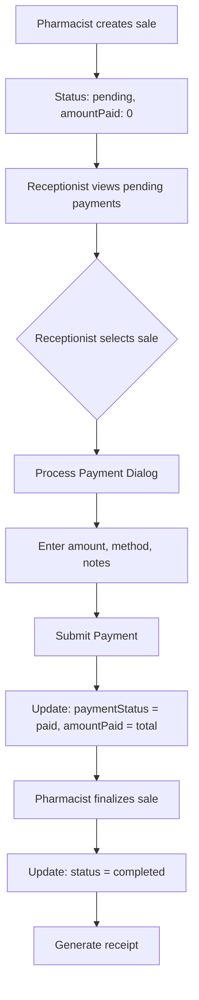

# Pharmacy Payment Processing Feature - Technical Specification

## 1. Executive Summary

This document outlines the technical design for a new pharmacy payment processing feature. The feature enables receptionists to process payments for pharmacy sales created by pharmacists and allows pharmacists to finalize sales after payment is received.

**Key Features:**

- Dedicated reception page for viewing and processing pending pharmacy payments
- API endpoints for payment processing and sale finalization
- Integration with existing cash management system
- Role-based access control (receptionist, pharmacist, admin)

---

## 2. Current System Analysis

### 2.1 Existing Pharmacy Workflow

The current pharmacy system has two components:

1. **Pharmacy Issue Page** (`app/pharmacy/issue/page.tsx`)
   - Pharmacist creates walk-in sales
   - Creates `PharmacySale` documents with `status: "pending"` and `amountPaid: 0`
   - Has a broken payment workflow that doesn't integrate with reception

2. **PharmacySale Model** (`lib/models/PharmacySale.ts`)
   - `saleId`: Auto-generated (e.g., SALES260212345)
   - `customerName`, `customerPhone`: Walk-in customer info
   - `invoiceNumber`: Invoice reference
   - `items`: Array of medication items
   - `totalAmount`, `amountPaid`, `balance`: Payment fields
   - `paymentMethod`: "cash" | "card" | "insurance"
   - `paymentStatus`: "pending" | "partial" | "paid"
   - `status`: "pending" | "completed" | "cancelled"
   - `soldBy`: Reference to pharmacist who created the sale

### 2.2 Identified Issues

1. No dedicated reception page for pharmacy payments
2. Payment workflow is broken - local state only, not persisted to database
3. Pharmacist can only finalize after payment, but no mechanism exists for receptionists to process payments
4. Existing `app/api/pharmacy/prescriptions/[id]/route.ts` uses old `Prescription` model, not `PharmacySale`

---

## 3. Proposed Solution

### 3.1 Page Location

```
app/reception/pharmacy-payments/page.tsx
```

**Rationale:**

- Follows existing pattern: `app/reception/lab-test-payments/page.tsx`
- Logical placement under reception module
- Consistent with other payment processing pages

### 3.2 Navigation Update

Add to `app/reception/layout.tsx` navLinks:

```typescript
{
  href: "/reception/pharmacy-payments",
  label: "Pharmacy Payments",
  icon: Pill, // or medication icon
}
```

---

## 4. User Flow



### Workflow Steps:

1. **Step 1 - Create Sale (Pharmacist)**
   - Pharmacist creates prescription at `app/pharmacy/issue/page.tsx`
   - Sale created with `status: "pending"`, `paymentStatus: "pending"`, `amountPaid: 0`

2. **Step 2 - Process Payment (Receptionist)**
   - Receptionist navigates to `/reception/pharmacy-payments`
   - Views list of pending payments
   - Selects a sale and processes payment
   - Payment updates: `paymentStatus: "paid"`, `amountPaid: totalAmount`

3. **Step 3 - Finalize Sale (Pharmacist)**
   - Pharmacist views completed payments at `app/pharmacy/issue/page.tsx`
   - Selects a paid sale and finalizes it
   - Sale updates: `status: "completed"`
   - Receipt is generated

---

## 5. API Endpoints Design

### 5.1 List Pending Pharmacy Payments

**Endpoint:** `GET /api/pharmacy/prescriptions/pending`

**Description:** Retrieve all pharmacy sales with `paymentStatus: "pending"`

**Query Parameters:**

- `page` (optional): Page number, default 1
- `limit` (optional): Items per page, default 20
- `search` (optional): Search by invoiceNumber, customerName, customerPhone

**Response:**

```json
{
  "success": true,
  "data": [
    {
      "_id": "...",
      "saleId": "SALES260212345",
      "invoiceNumber": "INV-170XXXXXXXXX",
      "customerName": "John Doe",
      "customerPhone": "+93 XXX XXX XXX",
      "totalAmount": 1500,
      "amountPaid": 0,
      "balance": 1500,
      "paymentMethod": "cash",
      "paymentStatus": "pending",
      "status": "pending",
      "items": [...],
      "soldBy": {
        "_id": "...",
        "name": "Pharmacist Name"
      },
      "createdAt": "2026-02-11T..."
    }
  ],
  "pagination": {
    "page": 1,
    "limit": 20,
    "total": 5,
    "pages": 1
  }
}
```

**Authorization:** `receptionist`, `admin`

---

### 5.2 Process Payment

**Endpoint:** `POST /api/pharmacy/prescriptions/[id]/payment`

**Description:** Process payment for a pharmacy sale

**Request Body:**

```json
{
  "amount": 1500,
  "paymentMethod": "cash",
  "discount": 0,
  "notes": "Payment received"
}
```

**Validation:**

- `amount`: Required, number, min 0, max balance
- `paymentMethod`: Required, enum ["cash", "card", "insurance"]
- `discount`: Optional, number, min 0, max 100 (percentage)
- `notes`: Optional, string, max 500

**Response:**

```json
{
  "success": true,
  "data": {
    "_id": "...",
    "saleId": "SALES260212345",
    "totalAmount": 1500,
    "amountPaid": 1500,
    "balance": 0,
    "paymentStatus": "paid",
    "updatedAt": "2026-02-11T..."
  },
  "message": "Payment processed successfully"
}
```

**Authorization:** `receptionist`, `admin`

**Business Logic:**

1. Calculate new balance: `balance = totalAmount - amountPaid`
2. Update `paymentStatus`:
   - If `amountPaid >= totalAmount`: "paid"
   - If `amountPaid > 0`: "partial"
   - Else: "pending"
3. If discount applied, reduce `totalAmount` proportionally

---

### 5.3 Get Sale Details

**Endpoint:** `GET /api/pharmacy/prescriptions/[id]`

**Description:** Get full details of a pharmacy sale

**Authorization:** `receptionist`, `pharmacist`, `admin`

---

### 5.4 Finalize Sale (Pharmacist)

**Endpoint:** `PATCH /api/pharmacy/prescriptions/[id]/finalize`

**Description:** Finalize a sale after payment is received (pharmacist only)

**Request Body:**

```json
{
  "status": "completed",
  "notes": "Sale finalized and medicines dispensed"
}
```

**Validation:**

- `status`: Must be "completed"
- `notes`: Optional

**Pre-conditions:**

- Sale must have `paymentStatus: "paid"` or `paymentStatus: "partial"` with `balance: 0`
- Sale must have `status: "pending"`

**Response:**

```json
{
  "success": true,
  "data": {
    "_id": "...",
    "saleId": "SALES260212345",
    "status": "completed",
    "finalizedBy": {
      "_id": "...",
      "name": "Pharmacist Name"
    },
    "finalizedAt": "2026-02-11T..."
  },
  "message": "Sale finalized successfully"
}
```

**Authorization:** `pharmacist`, `admin`

---

## 6. UI Design

### 6.1 Page Structure

```
app/reception/pharmacy-payments/page.tsx
├── Header
│   ├── Title: "Pharmacy Payments"
│   ├── Refresh Button
│   └── Stats Summary Cards
│       ├── Pending Count
│       ├── Total Due Amount
│       └── Average Sale Value
├── Search & Filters
│   └── Search by invoice/customer name/phone
├── Pending Payments Table
│   ├── Columns:
│   │   ├── Sale ID
│   │   ├── Invoice #
│   │   ├── Customer
│   │   ├── Items Count
│   │   ├── Total Amount
│   │   ├── Balance
│   │   ├── Payment Method
│   │   ├── Created At
│   │   └── Actions
│   └── Rows with action buttons
└── Payment Dialog (Modal)
    ├── Sale Summary
    ├── Payment Form
    │   ├── Amount (pre-filled with balance)
    │   ├── Payment Method Select
    │   ├── Discount Field
    │   └── Notes Field
    └── Submit/Cancel Buttons
```

### 6.2 Component Specifications

#### Stats Cards

- **Pending Payments**: Count of sales with `paymentStatus: "pending"`
- **Total Due Amount**: Sum of all pending balances
- **Average Sale Value**: Average of total amounts

#### Table Columns

| Column    | Description            | Sortable |
| --------- | ---------------------- | -------- |
| Sale ID   | Auto-generated sale ID | Yes      |
| Invoice # | Invoice reference      | Yes      |
| Customer  | Name and phone         | Yes      |
| Items     | Number of medications  | No       |
| Total     | Total amount (AFN)     | Yes      |
| Balance   | Amount due (AFN)       | Yes      |
| Method    | Payment method         | No       |
| Created   | Creation timestamp     | Yes      |
| Actions   | Process payment button | No       |

#### Payment Dialog

- **Summary Section**: Shows sale details (customer, items, total, already paid)
- **Amount Field**: Pre-filled with balance, editable for partial payments
- **Payment Method**: Dropdown with cash, card, insurance options
- **Discount**: Optional percentage or fixed amount
- **Notes**: Optional text field

---

## 7. Database Changes

### 7.1 PharmacySale Model Updates

The `PharmacySale` model already supports the required fields. No schema changes needed.

**Existing fields used:**

- `paymentStatus`: "pending" | "partial" | "paid"
- `amountPaid`: number
- `balance`: number
- `status`: "pending" | "completed" | "cancelled"

**Optional fields to add for enhanced tracking:**

```typescript
interface IPharmacySale {
  // ... existing fields ...

  // Payment tracking
  paymentReceivedAt?: Date;
  paymentReceivedBy?: mongoose.Types.ObjectId; // Receptionist
  paymentMethod?: "cash" | "card" | "insurance";

  // Finalization tracking
  finalizedAt?: Date;
  finalizedBy?: mongoose.Types.ObjectId; // Pharmacist
  receiptNumber?: string;
}
```

### 7.2 Recommended Schema Updates

```typescript
// Add to PharmacySaleSchema in lib/models/PharmacySale.ts

paymentReceivedAt: {
  type: Date,
},

paymentReceivedBy: {
  type: Schema.Types.ObjectId,
  ref: "User",
},

finalizedAt: {
  type: Date,
},

finalizedBy: {
  type: Schema.Types.ObjectId,
  ref: "User",
},

receiptNumber: {
  type: String,
},
```

---

## 8. Role-Based Access Control

| Feature                 | Receptionist | Pharmacist | Admin |
| ----------------------- | ------------ | ---------- | ----- |
| View pending payments   | ✅           | ✅         | ✅    |
| Process payment         | ✅           | ✅         | ✅    |
| View completed payments | ✅           | ✅         | ✅    |
| Finalize sale           | ❌           | ✅         | ✅    |
| Cancel sale             | ❌           | ✅         | ✅    |
| Apply discount > 10%    | ❌           | ✅         | ✅    |
| View reports            | ❌           | ✅         | ✅    |

---

## 9. Integration Points

### 9.1 Cash Management Integration

When payment is processed, create a cash transaction:

```typescript
// POST /api/dashboard/reception/cash
{
  transactionType: "deposit",
  amount: paymentAmount,
  source: "pharmacy_sale",
  referenceId: saleId,
  shift: "morning" | "evening" | "night"
}
```

### 9.2 Existing Pages Updates

**`app/pharmacy/issue/page.tsx` Updates:**

- Modify `handleProcessPayment()` to create sale with `status: "pending"` only
- Remove local `paymentStatus` state management
- After payment is processed by receptionist, pharmacist can finalize
- Add "Finalize" button for sales with `paymentStatus: "paid"`

---

## 10. Implementation Plan

### Phase 1: Backend API

1. Create `app/api/pharmacy/prescriptions/pending/route.ts`
2. Update `app/api/pharmacy/prescriptions/[id]/route.ts` to support `PharmacySale`
3. Create `app/api/pharmacy/prescriptions/[id]/payment/route.ts`
4. Create `app/api/pharmacy/prescriptions/[id]/finalize/route.ts`
5. Update `PharmacySale` model with tracking fields

### Phase 2: Frontend Reception Page

1. Create `app/reception/pharmacy-payments/page.tsx`
2. Add navigation link to reception layout
3. Implement table with search and pagination
4. Implement payment dialog
5. Add stats cards

### Phase 3: Integration

1. Update pharmacy issue page workflow
2. Connect payment processing to cash management
3. Add receipt generation
4. Testing and bug fixes

---

## 11. File Structure Summary

```
app/
├── reception/
│   ├── layout.tsx (update navLinks)
│   └── pharmacy-payments/
│       └── page.tsx (NEW)
│
└── api/
    └── pharmacy/
        └── prescriptions/
            ├── route.ts (update GET for pending)
            ├── pending/
            │   └── route.ts (NEW - list pending)
            └── [id]/
                ├── route.ts (update for PharmacySale)
                ├── payment/
                │   └── route.ts (NEW - process payment)
                └── finalize/
                    └── route.ts (NEW - finalize sale)
```

---

## 12. Testing Considerations

### Unit Tests

- Payment validation (amount limits, payment methods)
- Balance calculations with discounts
- Status transitions (pending → paid → completed)
- Authorization checks

### Integration Tests

- End-to-end payment flow
- Cash transaction creation
- Receipt generation
- Dashboard stats update

### Edge Cases

- Partial payments
- Discount calculations
- Concurrent payment attempts
- Network failures during payment

---

## 13. Security Considerations

1. **Authentication**: All endpoints require valid JWT token
2. **Authorization**: Role-based access (receptionist, pharmacist, admin)
3. **Idempotency**: Prevent duplicate payments for same sale
4. **Audit Trail**: Log all payment and finalization actions
5. **Input Validation**: Sanitize all user inputs
6. **HTTPS**: Ensure all API calls use HTTPS

---

## 14. Success Metrics

- Payment processing time < 30 seconds
- Zero duplicate payments
- 100% accurate balance calculations
- Successful integration with cash management
- User satisfaction score > 4/5

---

## 15. Open Questions

1. Should the receipt be auto-printed after finalization?
2. Should pharmacists be able to process payments directly?
3. Should discounts require admin approval?
4. How should expired/pending sales be handled?

---

**Document Version:** 1.0  
**Last Updated:** 2026-02-11  
**Author:** System Architect
